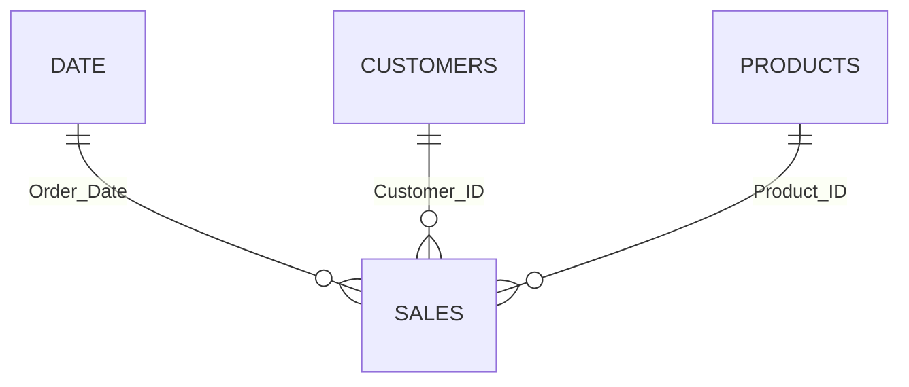

# 🛍️ E-Commerce Command System — Power BI Dashboard


A **six-page interactive** Power BI report on **250,000 e-commerce orders** (Jun 2024 – Jun 2026  **₹5.93B revenue**) — covering revenue, customers, products, operations and profitability.

> 🎯 Built with: star-schema model  30+ DAX measures  drill-through  custom tooltips  AI visuals  custom blue design system.

---

## 📊 At a Glance

| 💰 Revenue | 📦 Orders | 🧾 Avg Order Value | 👥 Customers |
|:---:|:---:|:---:|:---:|
| **₹5.93B** | **250K** | **₹23.72K** | **40K** |

🛒 2,000 products  25 brands  7 categories  10 states

---

## 📑 Pages

### 🎛️ Page 1 — Command Center
The whole business at a glance.
- 🎯 **KPIs:** Revenue ₹5.93B  Orders 250K  AOV ₹23.72K  Customers 40K
- 📈 **Visuals:** India revenue map  decomposition tree (Category → Brand → State → Payment)  Key Influencers (why orders fail)  metric-switcher trend
- 💡 **Insight:** Electronics alone drives ₹4.31B; failures are most influenced by Silver tier and Books category.

### 📋 Page 2 — Executive Overview
Growth and health under slicer control (Tier / State / Date).
- 🎯 **KPIs:** Revenue ₹5.93B  Delivered 80.1%  AOV ₹23.72K  Return Rate 5.0%  YoY 31.3%  MoM
- 📈 **Visuals:** AI anomaly detection  status donut  tier donut (Platinum 68.5% / Gold 16.8% / Silver 14.7%)  Top 10 cities  gauge vs 85% target  Q&A
- 💡 **Insight:** Growth is positive and status health is stable at 80% delivered.

### 👥 Page 3 — Customer Intelligence
Who customers are, what they're worth, how loyal they are.
- 🎯 **KPIs:** Repeat revenue 83.9%  CLV ₹148.6K  Repeat rate 98.8%  Churn 47.4%  Frequency 6.26  First-time buyers 16.0%
- 📈 **Visuals:** age  gender (50/50)  value bands  new vs returning  frequency by tier  revenue by tier & payment mode
- 💡 **Insight:** A loyal base (98.8% repeat) but 47.4% inactive 90+ days — the key reactivation opportunity.

### 📦 Page 4 — Product Performance
Catalogue, inventory and brand performance.
- 🎯 **KPIs:** Inventory ₹13.52B  Stock 1M  Rating 4.40  Products 2,000  Electronics share 72.6%  Avg price ₹13.18K
- 📈 **Visuals:** revenue by category  Top 10 brands  price-vs-volume scatter  return rate by category  brand word cloud  brand share over time
- 💡 **Insight:** Electronics = 72.6% of revenue (concentration risk); returns are a uniform ~5% everywhere.

### 🚚 Page 5 — Operations Monitor
Delivery, payment and fulfilment health.
- 🎯 **KPIs:** Delivery 4.5 days  Return 5.0%  Cancelled 5.0%  SLA 66.6%  Payment success 95.0%
- 📈 **Visuals:** payment mode mix  orders by hour (24)  status trend  orders by weekday (7)  delivery-time distribution
- 💡 **Insight:** Operations are exceptionally stable — flat hours/days/delivery; the only lever is pushing SLA above 66%.

### 💰 Page 6 — Revenue & Profitability
Where money is made, how it grows, what discounting costs.
- 🎯 **KPIs:** Revenue ₹5.93B  YoY 31.3%  MoM  Discount Leakage 1.02%  AOV ₹23.72K
- 📈 **Visuals:** revenue by state  gross vs net  cumulative revenue  Top 10 cities  revenue by year  AOV trend
- 💡 **Insight:** Revenue is diversified (no state > ~13%), AOV is flat, and leakage is a controlled ~1%.

---

## 🗄 Data Model



**Star schema** — one fact (`sales`, 250K) + three dimensions (`date`  `customers`  `products`). Date table marked for time intelligence; products ↔ sales bidirectional.

---

<details>
<summary>🧮 <b>DAX Highlights</b> (click to expand)</summary>

```dax
Total Revenue   = SUM(sales[Total_Amount])
Total Orders    = COUNTROWS(sales)
Avg Order Value = DIVIDE([Total Revenue], [Total Orders])

Return Rate %   = DIVIDE(CALCULATE([Total Orders], sales[Order_Status] = "Returned"), [Total Orders]) * 100
SLA Compliance %= DIVIDE(CALCULATE([Total Orders], sales[Delivery_Days] <= 5), [Total Orders]) * 100

Gross Revenue   = SUMX(sales, sales[Quantity] * sales[Unit_Price])
Discount Leakage % = DIVIDE([Gross Revenue] - [Total Revenue], [Gross Revenue]) * 100

Revenue LY      = CALCULATE([Total Revenue], SAMEPERIODLASTYEAR(date[Date]))
YoY Growth %    = DIVIDE([Total Revenue] - [Revenue LY], [Revenue LY]) * 100
Cumulative Revenue = CALCULATE([Total Revenue], FILTER(ALLSELECTED(date[Date]), date[Date] <= MAX(date[Date])))
```

**Calculated columns:** `Delivery_Days`  `Order_Hour`  `Order_Day` + `Day_Sort`  `Order Year_Month`  `Order Type`  `Is Problem`  `State_Full`

</details>

---

## ⚡ Features

🧭 Drill-through page  🖱️ custom tooltips  🎚️ field parameters  🔖 bookmarks (Reset)  🔄 synced slicers  🤖 Key Influencers  📉 anomaly detection  💬 Q&A  🎨 custom blue JSON theme with icon & logo system

---

## 💡 Key Insights

1. 🌍 Revenue is diversified — no state exceeds ~13%.
2. 📱 **Electronics = 72.6%** of revenue (concentration risk).
3. 💚 Customers are loyal — 98.8% repeat rate, 83.9% repeat revenue — but **47.4% inactive 90+ days**.
4. 📊 Growth is volume-driven; AOV is flat at ₹23.7K.
5. ⚙️ Operations are stable — uniform delivery, no peak hours/days, 95% payment success.
6. 🎯 Discount leakage is controlled at ~1%.

---

## 🚀 Run It

1. Open `E-Commerce_Dashboard.pbix` in **Power BI Desktop**.
2. Point the data source to the `data/` CSVs → **Refresh**.
3. Explore: click states on the map  flip the metric switcher  hover for tooltips  right-click a state to **drill through**.

---

## 👤 Author

**Saloni Jain** — data preparation, star-schema modelling, DAX, report design, and the custom visual identity (theme, icons, logo).
